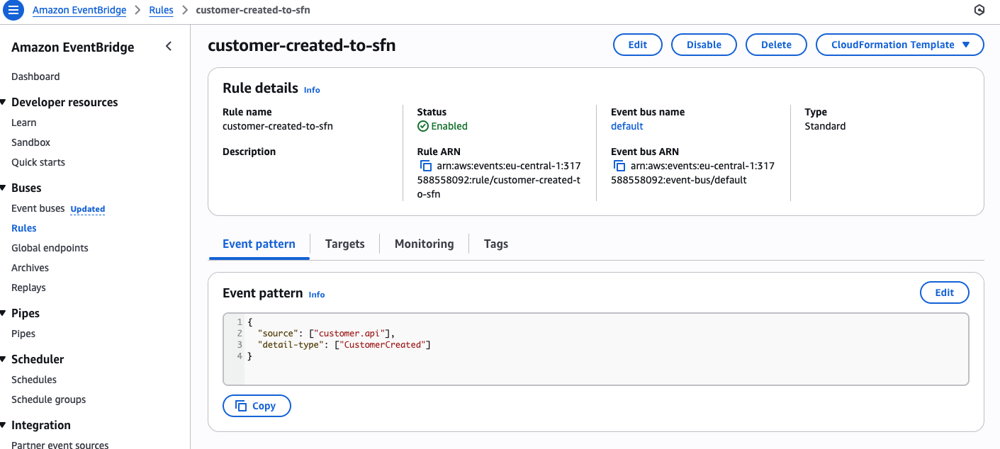
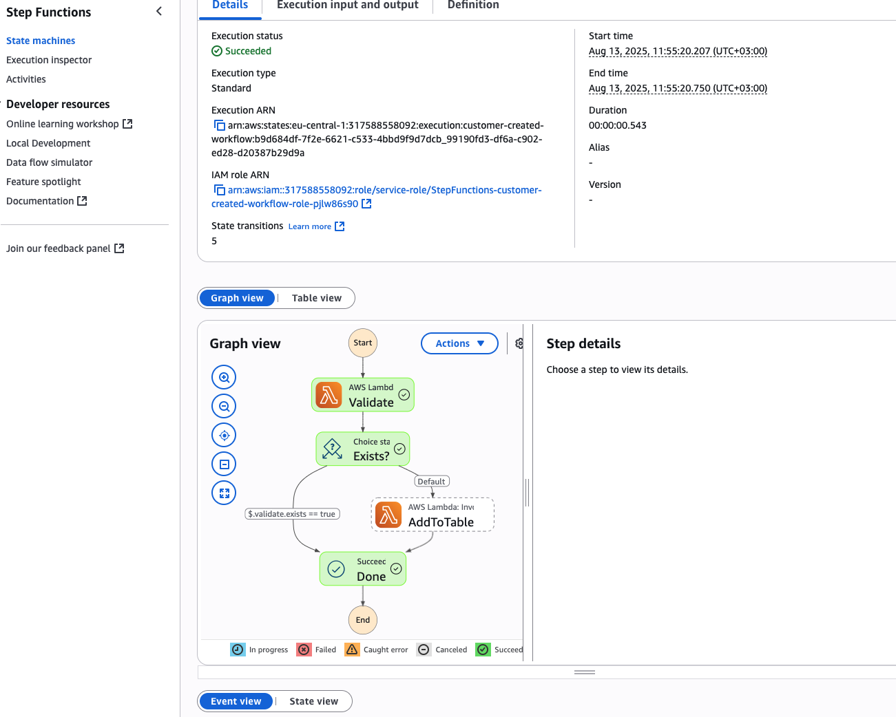
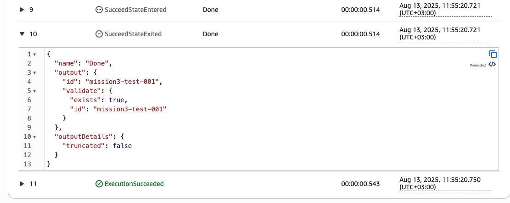
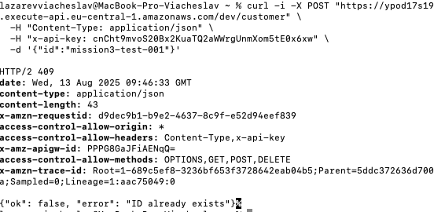

## Mission 3: Event-Driven Step Function Workflow

**Description:**  
When a new Customer ID is added via the API (`POST /customer`), the system publishes a `customer.added` event to **Amazon EventBridge**.  
The EventBridge rule (`customer-created-to-sfn`) triggers an **AWS Step Functions** state machine that performs three steps:

1. **Validate** — checks if the ID exists in DynamoDB.
2. **Choice** — decision: if the ID is found, log the event; if not, add it to the table.
3. **LogEvent** or **AddToTable** — executes the respective action.

**How to test:**

```bash
# Add a new ID (triggers the workflow)
curl -i -X POST "https://<invoke-id>.execute-api.eu-central-1.amazonaws.com/dev/customer"   -H "Content-Type: application/json"   -H "x-api-key: <api_key>"   -d '{"id":"mission3-test-001"}'

# Check if the ID exists
curl -i -X GET "https://<invoke-id>.execute-api.eu-central-1.amazonaws.com/dev/customer?id=mission3-test-001"   -H "x-api-key: <api_key>"
```

**Conclusions:**

-   The architecture is fully event-driven.
-   The EventBridge → Step Functions → Lambda → DynamoDB chain works as intended.
-   All steps are logged in CloudWatch.

---

### Screenshots:

-   
-   
-   
-   
